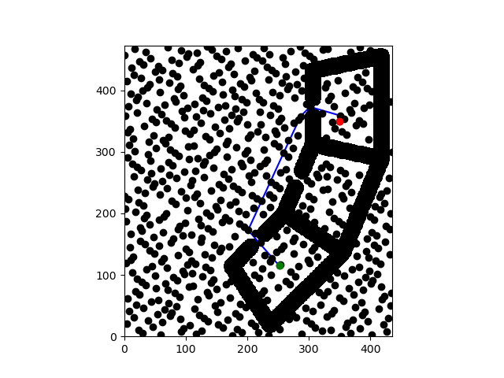
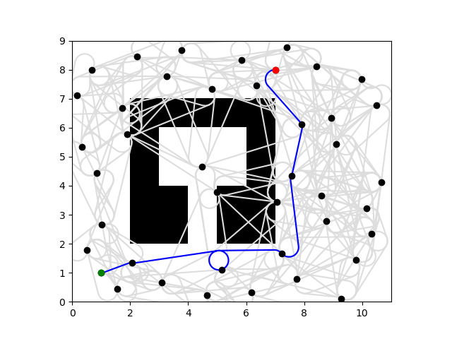
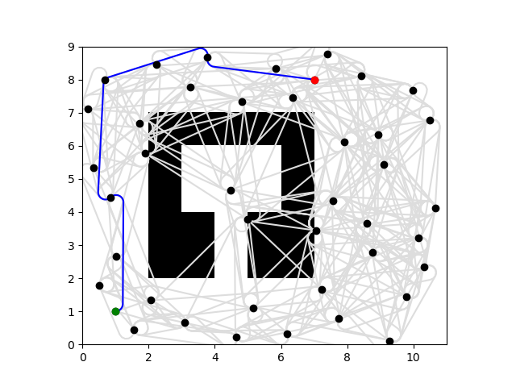
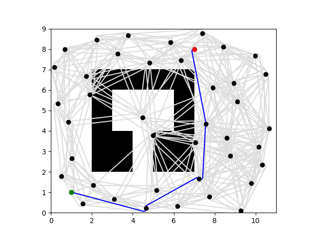
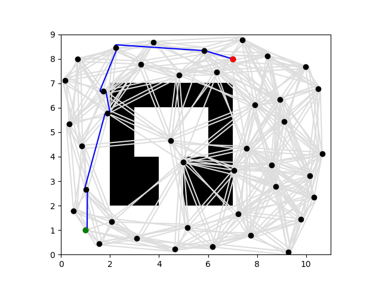
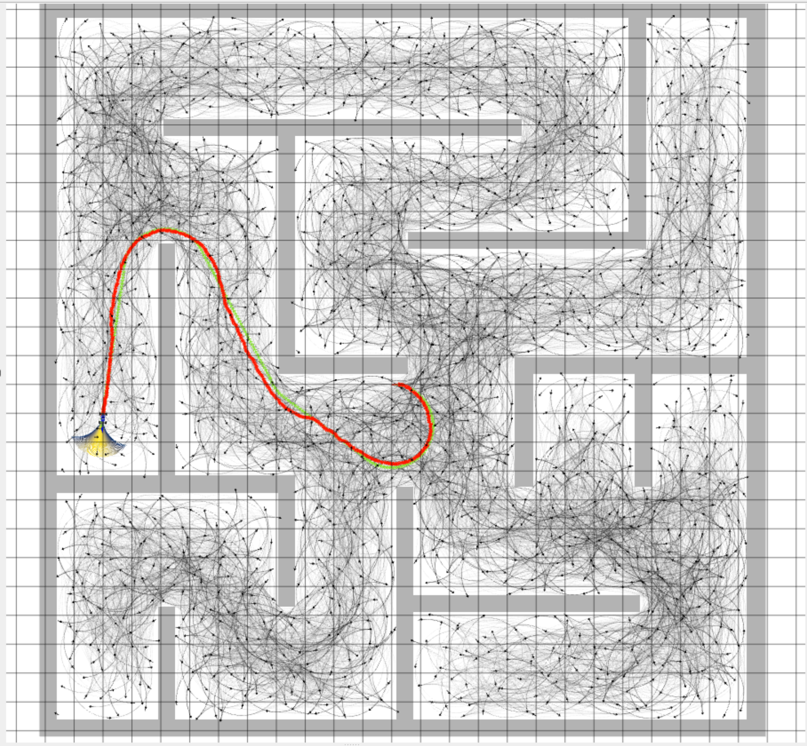
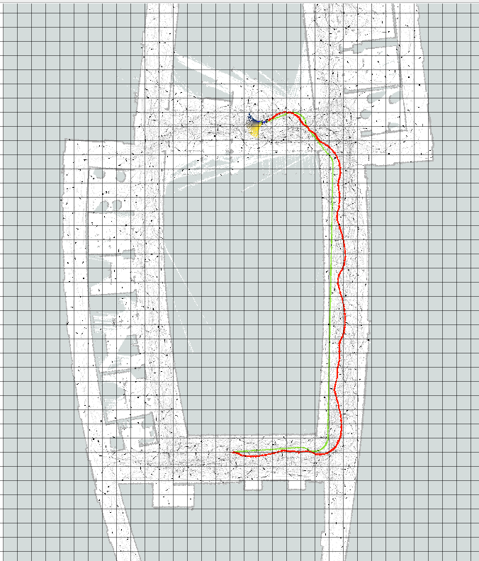
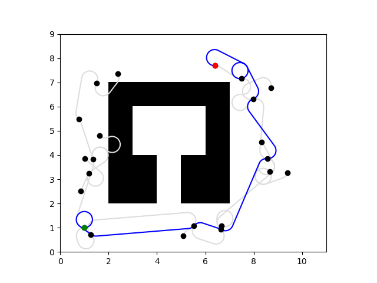

# Project 4: Planning 

Q1:\

Q2:
| Radius | Path Length | Planning Time |
| ------ | ----------- | ------------- |
| 200 | 362.89 | 3.226 |
| 140 | 362.89 | 1.598 |
| 130 | 362.89 | 1.377 |
| 120 | 362.89 | 1.179 |
| 110 | 362.89 | 0.999 |
| 100 | 362.89 | 0.856 |
| 90 | 362.89 | 0.654 |
| 80 | 362.91 | 0.505 |
| 70 | 362.97 | 0.394 |
| 65 | 363.07 | 0.309 |

As the connection radius is increased, the planning time increases because more nodes are being considered however the path length stops decreasing once the optimal path has been found. As the connection radius decreases, the path length increases slightly, resulting in an unoptimal path however the planning time is significantly decreased as well.

Q3: 
| Vertices | Path Length | Planning Time |
| -------- | ----------- | ------------- |
| 1200 | 356.33 | 3.107 |
| 675 | 356.33 | 0.996 |
| 650 | 362.89 | 0.917 |
| 625 | 362.89 | 0.850 |
| 600 | 362.89 | 0.816 |
| 575 | 362.89 | 0.712 |
| 550 | 362.89 | 0.660 |
| 545 | 362.89 | 0.661 |

As the number of vertices increase, the planning time increases however the path length also decreases in some instances when the additional vertices allow for a more optimal path. When decreasing the number of vertices, the planning time decreases and path length remains the same until there are not enough vertices to find a solution.

Q4:\
Vertices: 700\
Connection Radius: 100
| Algorithm | Path Length | Planning Time | Edges Evaluated |
| --------- | ----------- | ------------- | --------------- |
| A* | 356.33 | 1.144 | 31156 |
| Lazy A* | 356.33 | 0.159 | 992 |

With 700 vertices and a connection radius of 100, Lazy A* finds a path with the same length as A* in a fraction of the time and evaluating 30 times less edges. This is because the Lazy A* algorithm skips edges that are in collision.

Q5:\
Planning time: 0.00139\
Shortcutting time: 0.00516\
The planning time is significantly less than the shortcutting time however the shortcut length is less and the path only has two edges, making it go to the goal more directly.

Q6:\
Map1, Curvature 3:

Map1, Curvature 4.5:

Map1, Curvature 9:

Map1, Curvature 15:

From what we can see with these maps, as you increase the curvature, the turning radius decreases. Varying the curvature changes the optimal path each test finds. Additionally, as we incraese the curvature, the path lengths become shorter as well.

Q7: The minimum and maximum steering angles used by MPC are -0.34 and 0.34 radians respectively. Knowing that the distance between the axles is 0.33 meters, what is the maximum curvature for the MuSHR car? (Hint: think about the kinematic car model.)
The maximum curvature is: 

$$\frac{\tan(0.34)}{0.33} \approx 1.07 \text{ m}^{-1}$$

Q8:\
Maze_0 rviz:

\
Number of Vertices: 1500\
Connection Radius: 6\
Curvature: 0.7

Q9: Include an RViz screenshot of the MuSHR car tracking a path in cse2_2, as well as the parameters you used to construct the roadmap.
cse2_2 rviz:
\
Number of Vertices: 1500\
Connection Radius: 10\
Curvature: 1

Q10: We did not need to retune the particle filter. We adjusted the MPC's sampling time parameter from 30 to 15 to improve the path tracking on the car.

Q11: See planning.bag

Extra Credit Q5:

Q5.1:\
\

Q5.2: The step size determines how far sampled points are. Increasing it reduces the number of nodes in the tree, making computation quicker however, it creates jumpy paths which are longer. Decreasing it increases the number of nodes and makes smoother paths however, it takes longer to find paths. The bias determines how often the goal is chosen as the random sample. Increasing the bias pushes the path to be towards the goal more however too high of a value can stop the algorithm from finding a path at all because it is not able to get around obstacles. On the other hand, a very low value can cause the tree to wander more, creating a longer path.